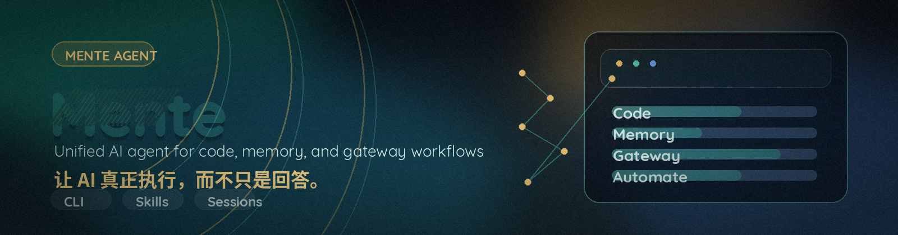

# Hermes 登顶之后，我们更确定了一件事：AI Agent 不该只是会聊天

今天看到一篇文章在讲 Hermes 超过 OpenClaw，登顶 OpenRouter 应用榜。

我停下来想了很久。

不是因为“谁排第一”这件事本身，而是因为它再次说明了一件更重要的事：**AI Agent 已经不再是圈内人的概念，它正在变成越来越多人每天都在使用的真实工具。**

当 AI 开始帮人写代码、调工具、跑流程、跨平台处理任务，行业讨论的重点也会跟着变化。

过去大家更关心模型会不会“说”。

接下来大家更关心 Agent 能不能“做”。

而这，恰好也是我们这段时间集中优化 Mente 的原因。



## 我们没有再做一个聊天框，而是在打磨一套能交付工作的 Agent

很多 AI 产品第一次看起来很强，但一落到真实工作里，很快就会暴露问题：

- 它能回答问题，但接不住任务
- 它能写几行代码，但不能持续执行
- 它在一个窗口里表现不错，换个平台、换个会话就像失忆
- 它能做演示，却很难进入你每天真正会反复使用的工作流

Mente 从一开始想解决的，就不是“再做一个更会聊天的壳”，而是把**编码、工具调用、消息网关、长期记忆、技能沉淀和持续执行**真正放进同一个系统里。

你可以把它理解成一个统一的 AI Agent 入口，而不是一个只会单轮回复的模型外壳。

## 这轮优化之后，Mente 最值得看的是什么

我们最近做了很多收边和重构，最终把一个更完整的产品面整理出来，并正式发布到了 GitHub。

最关键的变化，不是“加了几个新功能”，而是把真正影响长期使用体验的几件事都补齐了。


### 1. 对外产品身份统一了

CLI、消息平台、执行进度、用户可见回复，现在都统一以 **Mente** 的身份呈现。

这看起来像品牌动作，实际上是产品动作。一个 Agent 如果入口太碎、表述太乱，用户很难建立稳定心智，也很难真正信任它。

现在这层已经收口了。

### 2. 外层更顺了，底层执行力没有缩水

这次统一的不是能力，而是展示层。

复杂编码、工具调用和执行流程，底层仍然由 **Codex-backed executor** 支撑。换句话说，**外面更像一个完整产品，里面还是硬执行能力**。

### 3. 执行过程重新变得可见

很多 Agent 不是不会做，而是用户看不见它在做什么。

Mente 现在会把对外步骤整理成更容易理解的进度，同时保留底层命令和工具活动明细。对于真实工作来说，这一点非常关键，因为它决定了你能不能信任系统，也决定了出问题时能不能快速定位。

### 4. 会话不会轻易“白干”

复杂任务结束后，Mente 不只是做完就忘。

它可以把有价值的经验沉淀成长期记忆，也可以把高频工作整理成技能，在后续使用中继续优化。你不是每次都从零开始重新教它同一件事。

### 5. 不被单一平台和单一机器绑死

你可以在 CLI 里和它协作，也可以通过 Telegram、Discord、Slack、WhatsApp、Signal 等入口继续对话。你也可以把它跑在本地、Docker、SSH、Daytona、Singularity、Modal 这些后端上。

它更像一个常驻在线的 worker，而不是“只有你电脑开着它才存在”的助手。

### 6. 模型和推理服务不被锁定

OpenAI、OpenRouter、Nous Portal、NVIDIA NIM、GLM、Kimi、MiniMax、Hugging Face，或者你自己的兼容端点，都可以接进来。通过 `mente model` 就能切换，不需要改代码。

这意味着你可以根据成本、速度、模型特性自由选择，而不是被某一家供应商锁住。

## 为什么我们选择现在把它公开到 GitHub

因为到今天，Mente 已经不只是内部能跑起来的一套工具堆栈，而是一个对外部用户也有明确价值的统一 Agent 产品面。

我们觉得它已经具备了几件足够关键的事情：

- 有统一的产品身份
- 有足够硬的底层执行能力
- 有长期记忆和技能系统
- 有消息网关和多环境执行能力
- 有清晰的安装路径和公开文档

当这些链路打通之后，GitHub 就不再只是代码托管页，而是一个任何人都可以实际跑起来、判断它是否适合自己工作流的入口。


## 如果你第一次认识 Mente，最短上手路径很简单

当前推荐的安装方式是：

```bash
curl -fsSL https://raw.githubusercontent.com/chemany/Mente/main/scripts/install.sh | bash
source ~/.bashrc
mente
```

然后你可以按这个顺序开始：

1. 运行 `mente`
2. 用 `mente model` 选择 provider 和模型
3. 用 `mente tools` 配置工具
4. 用 `mente gateway` 接入消息平台
5. 用 `mente setup` 完成初始化

如果你更关心“它到底能不能长期替我做事”，那最值得看的不是一轮对话效果，而是这些能力是不是完整连起来了：

- 能不能从消息入口切到终端还继续同一件事
- 能不能把重复工作沉淀成记忆和技能
- 能不能定时运行、跨平台投递、长期无人值守
- 能不能在本地和云端环境里稳定执行

这才是 AI Agent 和普通聊天工具真正拉开差距的地方。

## 最后想说

Hermes 登顶，让更多人意识到 AI Agent 时代已经来了。

而我们这次做的事情，是把 Mente 进一步打磨成一个**真正能写代码、能调工具、会记忆、能跨平台持续执行的统一 Agent**，并把它正式带到 GitHub 上。

如果你也在找一个不是“只能聊天”，而是能持续替你做事的 AI Agent，Mente 现在已经值得你亲自试一次。

GitHub：<https://github.com/chemany/Mente>  
文档：<https://chemany.github.io/Mente/docs/>  
当前推荐安装方式：`curl -fsSL https://raw.githubusercontent.com/chemany/Mente/main/scripts/install.sh | bash`
