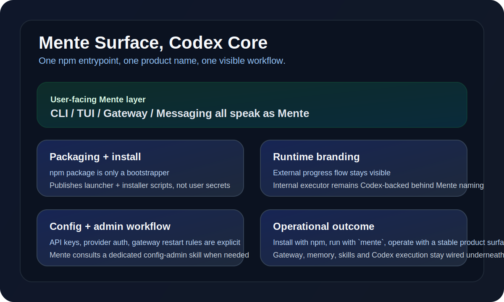

<p align="center">
  
</p>

<p align="center">
  <strong>English</strong> · <a href="./README.zh.md">中文</a>
</p>

# Mente Agent ☤

<p align="center">
  <a href="https://chemany.github.io/Mente/docs/"></a>
  <a href="https://discord.gg/NousResearch"></a>
  <a href="https://github.com/chemany/Mente/blob/main/LICENSE"></a>
  <a href="https://github.com/chemany/Mente"></a>
</p>

**Mente is a unified AI agent for coding, automation, gateway workflows, and long-term memory.** It creates skills from experience, improves them during use, nudges itself to persist knowledge, searches its own past conversations, and builds a deepening model of who you are across sessions. Run it on a $5 VPS, a GPU cluster, or serverless infrastructure that costs nearly nothing when idle. It's not tied to your laptop — talk to it from Telegram while it works on a cloud VM.

This branch also completes a product-surface consolidation pass:

- **External surface is uniformly Mente** across CLI, gateway progress, messaging, and user-facing replies.
- **Internal execution still runs on the Codex-backed executor** — the rename is presentation-layer cleanup, not a runtime downgrade.
- **Gateway progress is visible again** with Mente-facing step names while preserving detailed command/tool activity.
- **Config/admin operations are now explicit** through a dedicated Mente skill for API keys, provider auth, `.env`, `config.yaml`, and gateway restart rules.

<p align="center">
  
</p>

Use any model you want — [Nous Portal](https://portal.nousresearch.com), [OpenRouter](https://openrouter.ai) (200+ models), [NVIDIA NIM](https://build.nvidia.com) (Nemotron), [Xiaomi MiMo](https://platform.xiaomimimo.com), [z.ai/GLM](https://z.ai), [Kimi/Moonshot](https://platform.moonshot.ai), [MiniMax](https://www.minimax.io), [Hugging Face](https://huggingface.co), OpenAI, or your own endpoint. Switch with `mente model` — no code changes, no lock-in.

<table>
<tr><td><b>A real terminal interface</b></td><td>Full TUI with multiline editing, slash-command autocomplete, conversation history, interrupt-and-redirect, and streaming tool output.</td></tr>
<tr><td><b>Lives where you do</b></td><td>Telegram, Discord, Slack, WhatsApp, Signal, and CLI — all from a single gateway process. Voice memo transcription, cross-platform conversation continuity.</td></tr>
<tr><td><b>A closed learning loop</b></td><td>Agent-curated memory with periodic nudges. Autonomous skill creation after complex tasks. Skills self-improve during use. FTS5 session search with LLM summarization for cross-session recall. <a href="https://github.com/plastic-labs/honcho">Honcho</a> dialectic user modeling. Compatible with the <a href="https://agentskills.io">agentskills.io</a> open standard.</td></tr>
<tr><td><b>Scheduled automations</b></td><td>Built-in cron scheduler with delivery to any platform. Daily reports, nightly backups, weekly audits — all in natural language, running unattended.</td></tr>
<tr><td><b>Delegates and parallelizes</b></td><td>Spawn isolated subagents for parallel workstreams. Write Python scripts that call tools via RPC, collapsing multi-step pipelines into zero-context-cost turns.</td></tr>
<tr><td><b>Runs anywhere, not just your laptop</b></td><td>Six terminal backends — local, Docker, SSH, Daytona, Singularity, and Modal. Daytona and Modal offer serverless persistence — your agent's environment hibernates when idle and wakes on demand, costing nearly nothing between sessions. Run it on a $5 VPS or a GPU cluster.</td></tr>
<tr><td><b>Research-ready</b></td><td>Batch trajectory generation, Atropos RL environments, trajectory compression for training the next generation of tool-calling models.</td></tr>
</table>

---

## Quick Install

### Option 1: npm bootstrapper

```bash
npm install -g mente-agent
mente
```

The npm package is intentionally **thin**. It publishes only the launcher and installer scripts, then bootstraps the full Mente runtime on first run. By default the bootstrapper installs from the repo's `main` branch, and you can force a tagged release with `MENTE_BOOTSTRAP_RELEASE=<tag> mente`. It does **not** publish your local `.env`, `auth.json`, `~/.mente`, `~/.hermes`, sessions, logs, or other machine-local state.

### Option 2: direct installer

```bash
curl -fsSL https://raw.githubusercontent.com/chemany/Mente/main/scripts/install.sh | bash
```

Works on Linux, macOS, WSL2, and Android via Termux. The one-click installer is release-pinned by default and can also bootstrap a matching vendored Codex runtime from local/offline assets via `--runtime-artifact-manifest` and `--runtime-wheel`.

> **Android / Termux:** The tested manual path is documented in the [Termux guide](https://chemany.github.io/Mente/docs/getting-started/termux). On Termux, Mente installs a curated `.[termux]` extra because the full `.[all]` extra currently pulls Android-incompatible voice dependencies.
>
> **Windows:** Native Windows is not supported. Please install [WSL2](https://learn.microsoft.com/en-us/windows/wsl/install) and run the command above.
>
> **Developers / source checkouts:** use `./setup-hermes.sh` after cloning the repo manually. That path is for editable development, not the frozen end-user release install.

After installation:

```bash
source ~/.bashrc    # reload shell (or: source ~/.zshrc)
mente               # start chatting!
```

---

## Getting Started

```bash
mente               # Interactive CLI — start a conversation
mente model         # Choose your LLM provider and model
mente tools         # Configure which tools are enabled
mente config set    # Set individual config values
mente gateway       # Start the messaging gateway (Telegram, Discord, etc.)
mente setup         # Run the full setup wizard (configures everything at once)
mente claw migrate  # Migrate from OpenClaw (if coming from OpenClaw)
mente update        # Update to the latest version
mente doctor        # Diagnose any issues
```

📖 **[Full documentation →](https://chemany.github.io/Mente/docs/)**

## What This Refresh Changes

This README tracks the current Mente packaging and runtime direction:

- **One install command for GitHub visitors:** `npm install -g mente-agent`
- **One visible agent identity:** user-facing replies and progress now present as `Mente`
- **Same execution depth under the hood:** complex coding and tool work still route through the Codex-backed executor
- **Safer operations surface:** packaging is whitelist-based, and config/admin actions now have explicit handling for API keys, provider auth, and restart boundaries

If you are evaluating Mente from GitHub, the practical model is:

1. Install the bootstrap package from npm.
2. Launch `mente`.
3. Let the bundled installer bring down the full runtime.
4. Use Mente normally from CLI or gateway surfaces.

## CLI vs Messaging Quick Reference

Mente has two entry points: start the terminal UI with `mente`, or run the gateway and talk to it from Telegram, Discord, Slack, WhatsApp, Signal, or Email. Once you're in a conversation, many slash commands are shared across both interfaces.

| Action | CLI | Messaging platforms |
|---------|-----|---------------------|
| Start chatting | `mente` | Run `mente gateway setup` + `mente gateway start`, then send the bot a message |
| Start fresh conversation | `/new` or `/reset` | `/new` or `/reset` |
| Change model | `/model [provider:model]` | `/model [provider:model]` |
| Set a personality | `/personality [name]` | `/personality [name]` |
| Retry or undo the last turn | `/retry`, `/undo` | `/retry`, `/undo` |
| Compress context / check usage | `/compress`, `/usage`, `/insights [--days N]` | `/compress`, `/usage`, `/insights [days]` |
| Browse skills | `/skills` or `/<skill-name>` | `/<skill-name>` |
| Interrupt current work | `Ctrl+C` or send a new message | `/stop` or send a new message |
| Platform-specific status | `/platforms` | `/status`, `/sethome` |

For the full command lists, see the [CLI guide](https://chemany.github.io/Mente/docs/user-guide/cli) and the [Messaging Gateway guide](https://chemany.github.io/Mente/docs/user-guide/messaging).

---

## Documentation

All documentation lives at **[chemany.github.io/Mente/docs](https://chemany.github.io/Mente/docs/)**:

| Section | What's Covered |
|---------|---------------|
| [Quickstart](https://chemany.github.io/Mente/docs/getting-started/quickstart) | Install → setup → first conversation in 2 minutes |
| [CLI Usage](https://chemany.github.io/Mente/docs/user-guide/cli) | Commands, keybindings, personalities, sessions |
| [Configuration](https://chemany.github.io/Mente/docs/user-guide/configuration) | Config file, providers, models, all options |
| [Messaging Gateway](https://chemany.github.io/Mente/docs/user-guide/messaging) | Telegram, Discord, Slack, WhatsApp, Signal, Home Assistant |
| [Security](https://chemany.github.io/Mente/docs/user-guide/security) | Command approval, DM pairing, container isolation |
| [Tools & Toolsets](https://chemany.github.io/Mente/docs/user-guide/features/tools) | 40+ tools, toolset system, terminal backends |
| [Skills System](https://chemany.github.io/Mente/docs/user-guide/features/skills) | Procedural memory, Skills Hub, creating skills |
| [Memory](https://chemany.github.io/Mente/docs/user-guide/features/memory) | Persistent memory, user profiles, best practices |
| [MCP Integration](https://chemany.github.io/Mente/docs/user-guide/features/mcp) | Connect any MCP server for extended capabilities |
| [Cron Scheduling](https://chemany.github.io/Mente/docs/user-guide/features/cron) | Scheduled tasks with platform delivery |
| [Context Files](https://chemany.github.io/Mente/docs/user-guide/features/context-files) | Project context that shapes every conversation |
| [Architecture](https://chemany.github.io/Mente/docs/developer-guide/architecture) | Project structure, agent loop, key classes |
| [Contributing](https://chemany.github.io/Mente/docs/developer-guide/contributing) | Development setup, PR process, code style |
| [CLI Reference](https://chemany.github.io/Mente/docs/reference/cli-commands) | All commands and flags |
| [Environment Variables](https://chemany.github.io/Mente/docs/reference/environment-variables) | Complete env var reference |

---

## Migrating from OpenClaw

If you're coming from OpenClaw, Mente can automatically import your settings, memories, skills, and API keys.

**During first-time setup:** The setup wizard (`mente setup`) automatically detects `~/.openclaw` and offers to migrate before configuration begins.

**Anytime after install:**

```bash
mente claw migrate              # Interactive migration (full preset)
mente claw migrate --dry-run    # Preview what would be migrated
mente claw migrate --preset user-data   # Migrate without secrets
mente claw migrate --overwrite  # Overwrite existing conflicts
```

What gets imported:
- **SOUL.md** — persona file
- **Memories** — MEMORY.md and USER.md entries
- **Skills** — user-created skills → `~/.hermes/skills/openclaw-imports/`
- **Command allowlist** — approval patterns
- **Messaging settings** — platform configs, allowed users, working directory
- **API keys** — allowlisted secrets (Telegram, OpenRouter, OpenAI, Anthropic, ElevenLabs)
- **TTS assets** — workspace audio files
- **Workspace instructions** — AGENTS.md (with `--workspace-target`)

See `mente claw migrate --help` for all options, or use the `openclaw-migration` skill for an interactive agent-guided migration with dry-run previews.

---

## Contributing

We welcome contributions! See the [Contributing Guide](https://chemany.github.io/Mente/docs/developer-guide/contributing) for development setup, code style, and PR process.

Quick start for contributors — clone and go with `setup-hermes.sh`:

```bash
git clone https://github.com/chemany/Mente.git
cd Mente
./setup-hermes.sh     # installs uv, creates venv, installs .[all], symlinks ~/.local/bin/mente
./mente               # auto-detects the venv, no need to `source` first
```

Manual path (equivalent to the above):

```bash
curl -LsSf https://astral.sh/uv/install.sh | sh
uv venv venv --python 3.11
source venv/bin/activate
uv pip install -e ".[all,dev]"
scripts/run_tests.sh
```

> **RL Training (optional):** The RL/Atropos integration (`environments/`) ships via the `atroposlib` and `tinker` dependencies pulled in by `.[all,dev]` — no submodule setup required.

---

## Community

- 💬 [Discord](https://discord.gg/NousResearch)
- 📚 [Skills Hub](https://agentskills.io)
- 🐛 [Issues](https://github.com/chemany/Mente/issues)
- 🔌 [HermesClaw](https://github.com/AaronWong1999/hermesclaw) — Community WeChat bridge: Run Mente and OpenClaw on the same WeChat account.

---

## License

MIT — see [LICENSE](LICENSE).

Built for the Mente project.
